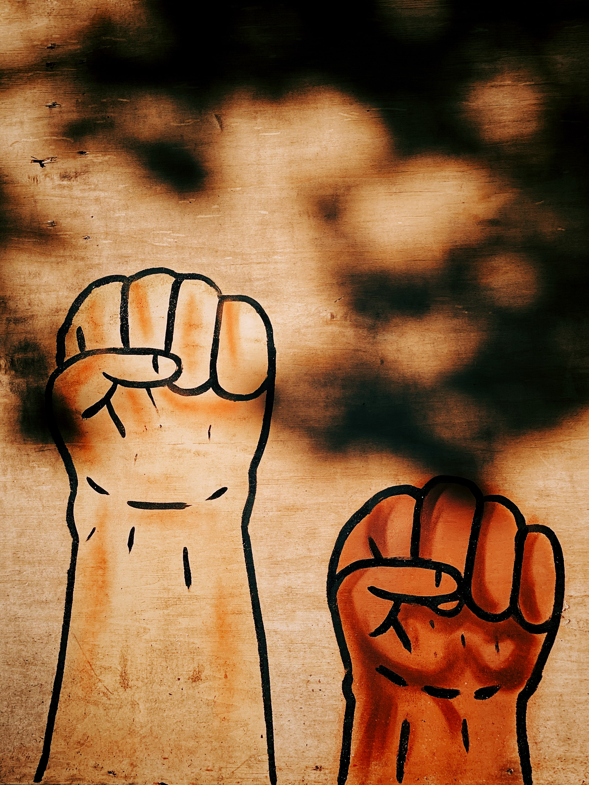

{::comment}
The student list is below.  The styles controlling its formatting are in `_sass/project.scss`. It
automatically takes care of laying out the alternating picture display.
{:/comment}

{: .project-list}

-   
    {: .pic}

    **Bias and Discrimination in Recommender Systems** 
	Researches on advancement of recommender systems have lead to the question of fairness. Reseraches have shown that recommender systems can be susceptible to bias. However, the definition of fairness, the source of unfairness, the impact of bias in recommndations, and the mitigation of the situation are still some unresolved issues to work on.
	In this project, we are focusing on fairness in ranked output by conducting following analysis:

	1. Comparison among the fair ranking metrics
	2. 

    **Review-based Recommendations** 

